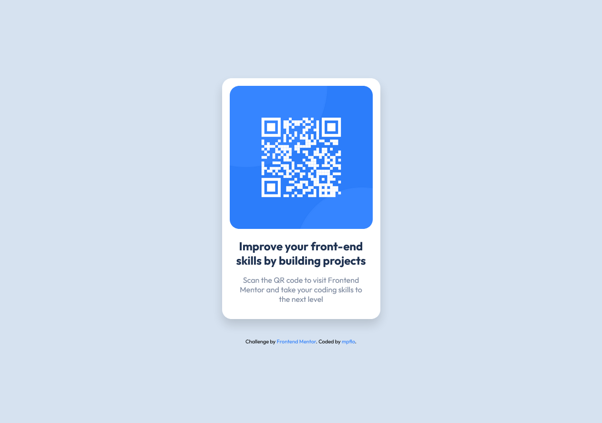

# Frontend Mentor - QR code component solution

This is a solution to the [QR code component challenge on Frontend Mentor](https://www.frontendmentor.io/challenges/qr-code-component-iux_sIO_H). Frontend Mentor challenges help you improve your coding skills by building realistic projects. 

## Table of contents

- [Overview](#overview)
  - [Screenshot](#screenshot)
  - [Links](#links)
- [My process](#my-process)
  - [Built with](#built-with)
  - [What I learned](#what-i-learned)
  - [Continued development](#continued-development)
- [Author](#author)
- [Acknowledgments](#acknowledgments)

**Note: Delete this note and update the table of contents based on what sections you keep.**

## Overview

### Screenshot

#### Screnshot for mobile:

#### Screenshot for desktop:

### Links

- Solution URL: [Link to the project's repo](https://github.com/mpflo/qr-code-component)
- Live Site URL: [Project's live URL](https://mpflo.github.io/qr-code-component/)

## My process

### Built with

- Semantic HTML5 markup
- CSS custom properties
- Flexbox

### What I learned

This was a very easy project to do. As the layout does not vary the width of the box with the text, I set a width with an absolute unit of 332px and centered this box with the help of Flexbox.

### Continued development

I need to improve my knowledge of Flexbox, which at the moment is basic, and of media query, because I want to make projects that adapt better to all types of screens.

## Author

- GitHub - [@mpflo](https://github.com/mpflo)
- Frontend Mentor - [@qipeot](https://www.frontendmentor.io/profile/qipeot)

## Acknowledgments

I really want to thanks [@kaiquegarcia](https://github.com/kaiquegarcia) for helping me out and being a patient mentor!
